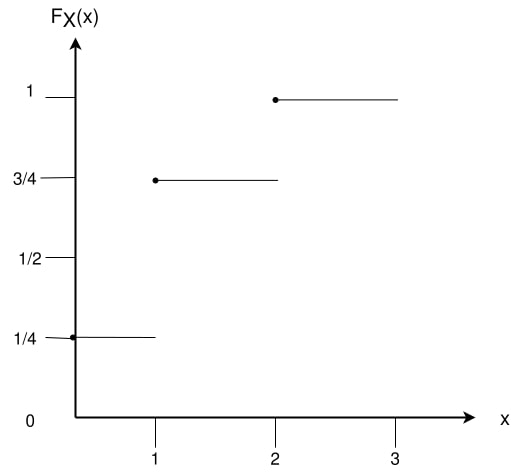

### Definition 2 _(Probability distributive function)_ :
The distributive function of a random variable $\mathcal{X}$ is the function $F : \mathbb{R} \to [0, 1] $ given by $F(x) = \mathbb{P}(\mathcal{X} \leq x)$

- For the above Example
$$\begin{equation}
  F_{\mathcal{X}}(x) =
    \begin{cases}
      0 & \text{$x < 0$}\\
      \frac{1}{4} & \text{$0 \leq x < 1$}\\
      \frac{3}{4} & \text{$ 1 \leq x < 2$}\\
      1 & \text{$x \geq 2$} 
    \end{cases}       
\end{equation} $$

$$\begin{equation}
  F_{\mathcal{W}}(\omega) =
    \begin{cases}
      0 & \text{$\omega < 0$}\\
      \frac{3}{4} & \text{$ 0 \leq \omega < 4$}\\
      1 & \text{$\omega \geq 4$} 
    \end{cases}       
\end{equation} $$

The distribution $F$ has the following properties
- $\lim_{x \to - \infty} F(x) = 0 $, $\lim_{x \to \infty} F(x) = 1$

- if $x < y$. then $F(x) \leq F(y)$

- $F$ is a right continous, that is $F(x + h) \to F(x)$ as $h \to 0$

$F$ is the distribution function of some random variables if and only if it satisfies the above 3 properties.

Suppose $F$ is a distributive function of $\mathcal{X}$. Then 
- $\mathbb{P}(\mathcal{X} > x) = 1 - F(x)$

- $\mathbb{P}(x < \mathcal{X} \leq y) = F(y) -F(x)$

- $\mathbb{P}(\mathcal{X} = x) = F(x) - \lim_{(y \to x)} F(y)$